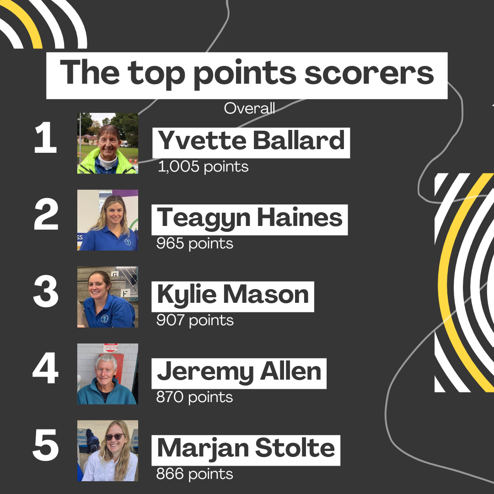
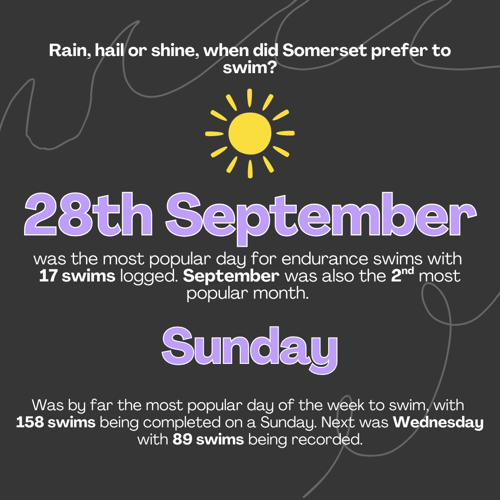
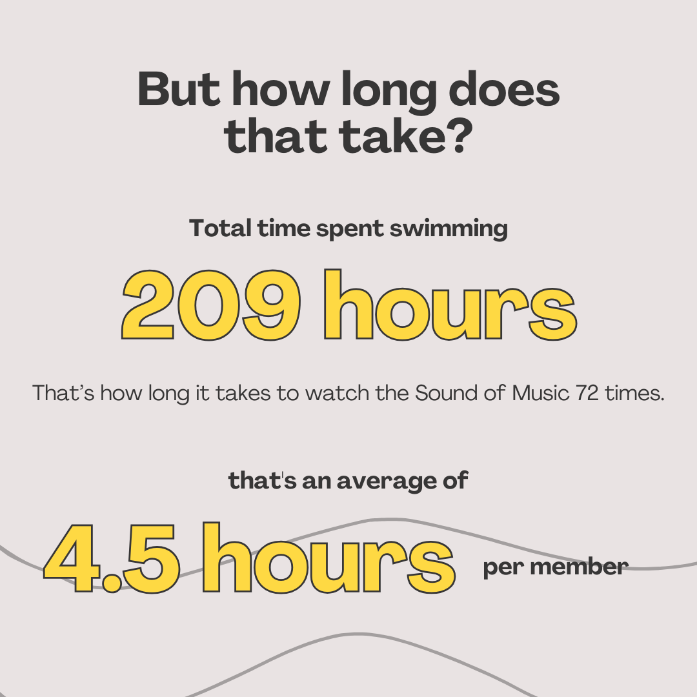

# Endurance wrapped 2025
These png snapshots were created for the Somerset Masters Swimming Club at the end of the 2025 endurance (E1000) competition year to present at the awards night and for distribution through social media. 

## Purpose
To display interesting and insightful statistics from the year to swimmers so that they can commemorate the end of the endurance competition. 

Strong inspiration was taken from the 2025 Spotify Wrapped. 

## Data source
Data was scraped from the E1000 website using the Somerset recorder app (link TBA, Github folder is currently private). 

All data used is publicly accessible on the E1000 website (https://e1000.msarc.org.au/results/results.php). 

All photos used are also publicly available on  Somerset Masters social media and permission was given by each participant. 

The year-end png's were created using Canva and additional data wrangling was undertaken in R to determine key values. 

## Key slides
### Overall results

### Swim day insights

### Key statistics

